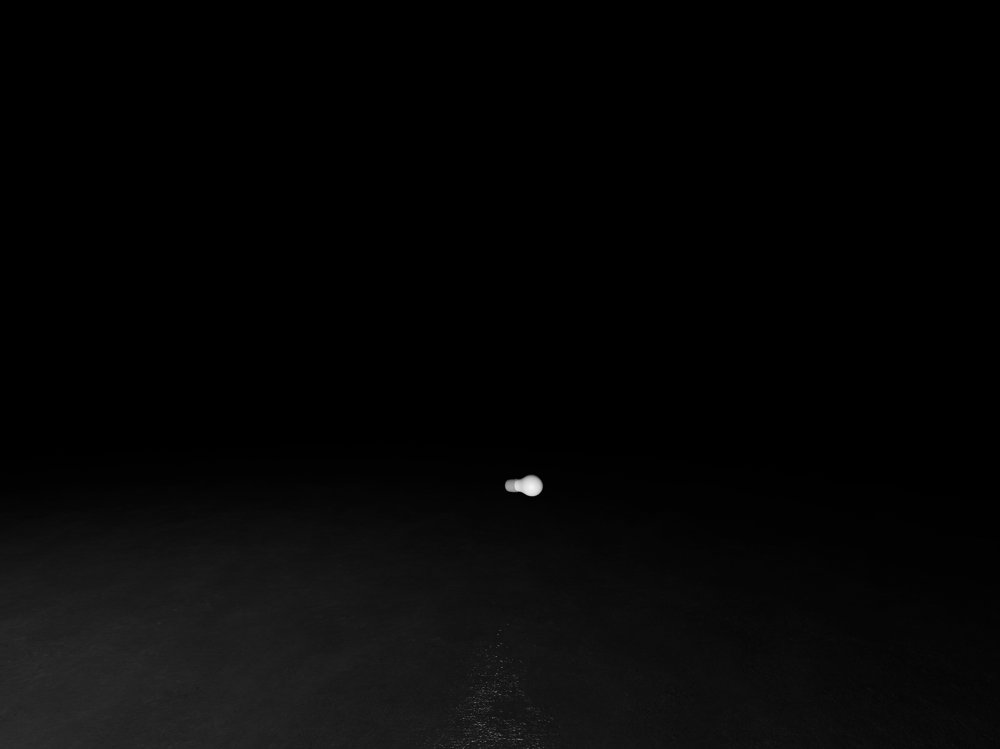
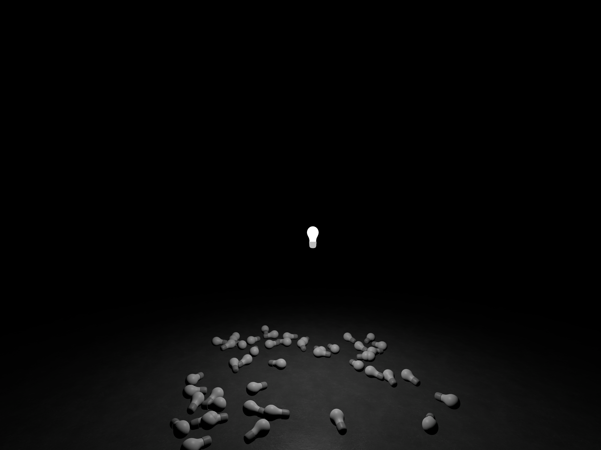

# A Bright Idea

My submission for [Vision Hack](https://www.visionoshackathon.com) 2024.

[Watch the demo video](https://youtu.be/SGqOGoe1InM)

---

### A Bright Idea

I thought I had something—a bright idea.

The plan was to build a small app to help organize thoughts in an immersive space, with each idea represented by its scale and brightness. I created a simple light bulb mesh and began prototyping with a point light.

That’s when I hit my first wall.

> A RealityKit scene can contain up to eight dynamic lights

Apple Documentation for [PointLight](https://developer.apple.com/documentation/realitykit/pointlight)

I don't know about you, but I have more than eight ideas, and all of them worth keeping.

I looked for alternatives. How about emissive materials?

> You can set this property to values greater than 1.0.

Apple Documentation for [emissiveIntensity](https://developer.apple.com/documentation/realitykit/physicallybasedmaterial/emissiveintensity)

I gave it a try, but no matter how high I set the value—1.0, 10, 100, or even 1,000—nothing changed visually in my dark scene.

Point lights wouldn’t work, and emissive materials didn’t capture the distinction between ideas as I hoped. My idea came crashing down.

And that gave me a new idea! What if I set aside the original plan and embraced failure instead? 

I kept reaching for idea after idea and they kept crashing down.

But I kept working, and I ended up here.

A Bright Idea and all the failures along the way.

---

Joseph, September 15, 2024

[Watch the demo video](https://youtu.be/SGqOGoe1InM)

---

### Credits
* Code by Joseph Simpson (and ChatGPT to help)
* Light Bulb Model - Joseph Simpson
* Sound Effects - [Kenney Assets](https://kenney.nl)
* Melancholy - RealityKit with special guest Reality Composer Pro