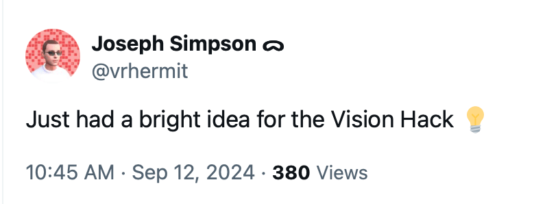
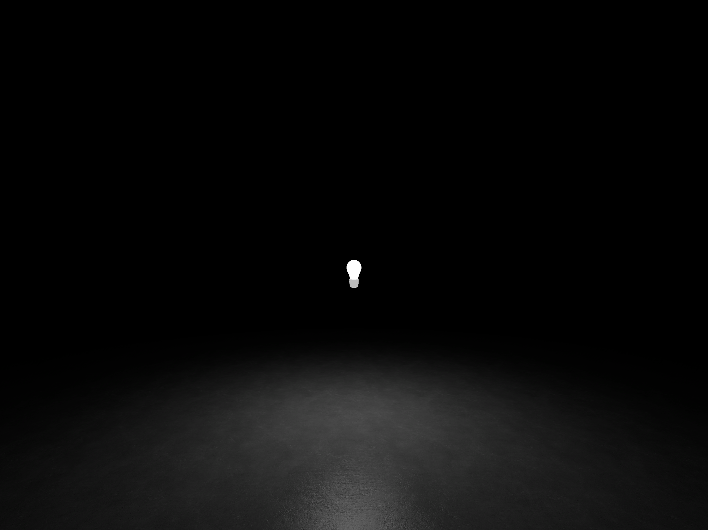

# A Bright Idea

My entry for Vision Hack 2024.

I thought I had a bright idea.

I set out to create a small app to organize your ideas in an immersive space. Each idea could be represented by scale and brightness. I created a simple light bulb mesh and started the prototype with a point light.

I ran face first into my first issue.

> A RealityKit scene can contain up to eight dynamic lights

Apple Documentation for [PointLight](https://developer.apple.com/documentation/realitykit/pointlight)